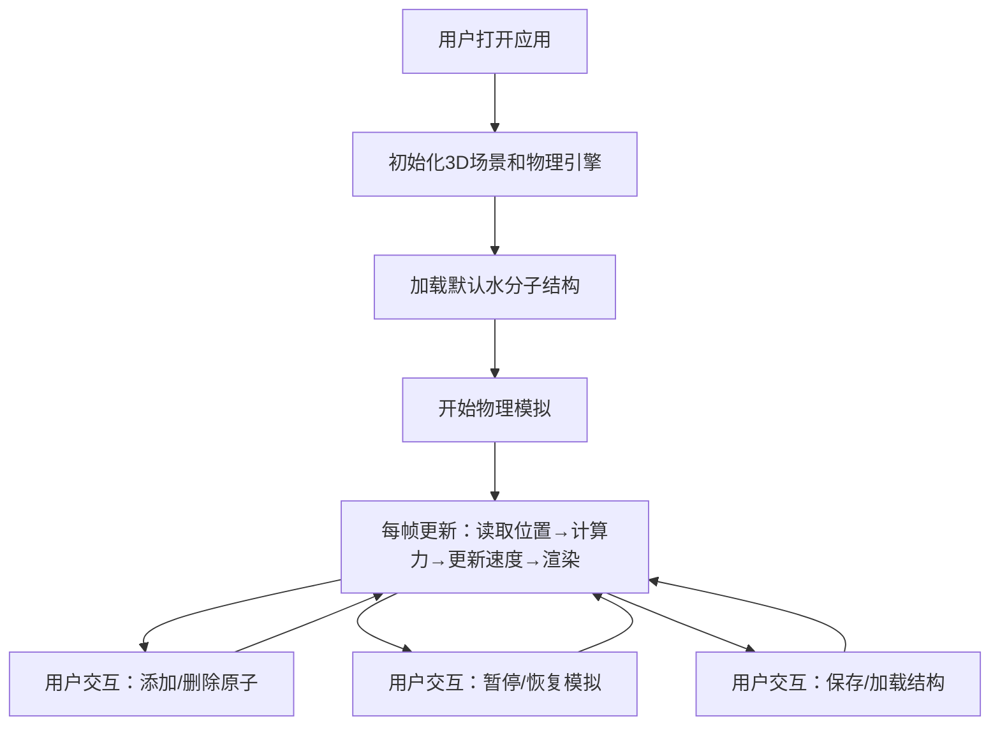

## 1. 产品概述

Web端分子动力学模拟器是一个在浏览器中运行的3D分子模拟应用，通过可视化方式展示分子间相互作用的物理过程。适用于化学、物理教育领域的教学演示和基础研究。

- 主要用途：教育演示、分子结构可视化、基础分子动力学模拟
- 目标用户：化学/物理教师、学生、科研入门者
- 产品价值：降低分子动力学模拟的使用门槛，提供直观的3D交互体验

## 2. 核心功能

### 2.1 用户角色
| 角色 | 注册方式 | 核心权限 |
|------|----------|----------|
| 普通用户 | 无需注册 | 使用全部模拟功能，保存/加载本地分子结构 |

### 2.2 功能模块
1. **3D模拟场景**：分子渲染、物理模拟、相机控制
2. **控制面板**：原子操作、模拟控制、参数调节
3. **数据显示**：实时能量监控、原子信息标签
4. **数据管理**：分子结构保存/加载（JSON格式）

### 2.3 页面详情
| 页面名称 | 模块名称 | 功能描述 |
|-----------|-------------|---------------------|
| 主页面 | 3D模拟场景 | Three.js渲染3D分子模型，支持轨道控制（旋转/缩放/平移） |
| 主页面 | 原子操作面板 | 添加H/O/C/N四种原子，删除选中原子，选择原子类型 |
| 主页面 | 模拟控制面板 | 暂停/恢复模拟、重置模拟、调节模拟速度 |
| 主页面 | 能量显示面板 | 实时显示动能、势能、总能量数值及变化趋势 |
| 主页面 | 数据管理面板 | 保存分子结构到本地JSON文件、从JSON文件加载结构 |
| 主页面 | 原子标签 | 每个原子显示元素符号，始终面向相机 |

## 3. 核心流程

用户打开应用 → 初始场景加载水分子示例 → 通过面板添加/删除原子 → 观察分子运动和能量变化 → 调整模拟参数 → 保存/加载分子结构

## 4. 用户界面设计

### 4.1 设计风格
- **主色调**：深空蓝 (#0a192f) 背景，科技感青色 (#64ffda) 作为强调色
- **辅助色**：原子特征色（H-白色、O-红色、C-灰色、N-蓝色）
- **按钮风格**：圆角玻璃拟态，半透明背景，悬浮时发光效果
- **字体**：JetBrains Mono（等宽字体，科技感）作为显示字体，Inter 作为正文字体
- **布局风格**：左侧固定控制面板，右侧全屏3D场景，顶部状态栏显示能量数据
- **图标风格**：使用 lucide-react 线性图标，与整体科技风格统一

### 4.2 页面设计概述
| 页面名称 | 模块名称 | UI Elements |
|-----------|-------------|-------------|
| 主页面 | 3D模拟场景 | 深色背景、雾化效果、网格辅助线、柔和环境光 + 方向光 |
| 主页面 | 控制面板 | 半透明深色玻璃面板、分组折叠、圆角按钮、滑块控件 |
| 主页面 | 能量显示 | 顶部悬浮条、实时数值、微动画、能量柱状图 |
| 主页面 | 原子标签 | 白色文字、深色半透明背景、元素符号+原子ID |

### 4.3 响应性
- Desktop-first 设计，1280px 以上最佳体验
- 移动端自动调整面板布局，控制面板转为底部抽屉式
- 触摸优化：双指缩放、单指旋转

### 4.4 3D场景指导
- **环境**：深色渐变背景 + 轻微雾化效果，营造科研氛围
- **光照**：AmbientLight (强度0.4) + DirectionalLight (强度0.8，带阴影) + 2个PointLight补光
- **相机**：PerspectiveCamera，初始位置(0, 5, 15)，fov=60
- **构图**：分子居中，网格平面位于y=-2处作为参考
- **交互**：OrbitControls，支持阻尼效果，限制最小距离3，最大距离50
- **后处理**：Bloom效果（轻微），增强原子发光感
- **性能预算**：最多支持100个原子，目标帧率60fps

## 5. 交互细节
- 点击原子选中，高亮显示，显示详细属性（质量、速度、受力）
- 双击空白处添加当前选中类型的原子
- 拖拽原子可临时调整位置（暂停时）
- 键盘快捷键：Space暂停/恢复，R重置，1-4切换原子类型
