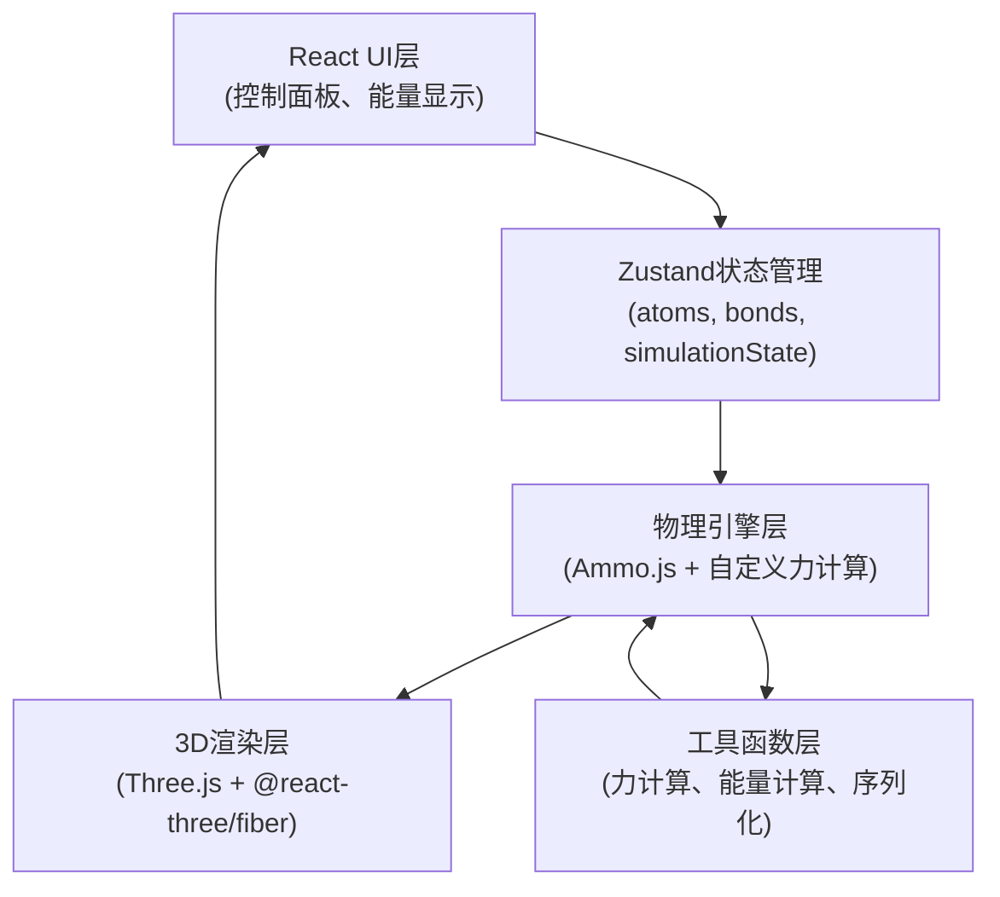
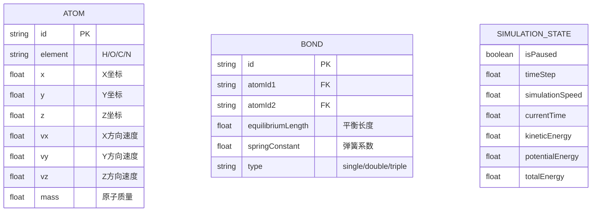

## 1. 架构设计



## 2. 技术描述

- **前端框架**：React@18 + TypeScript@5 + Vite@5
- **3D渲染**：three@0.160 + @react-three/fiber@8 + @react-three/drei@9 + @react-three/postprocessing@2
- **物理引擎**：ammo.js (WASM版本，Bullet Physics)
- **状态管理**：zustand@4
- **样式方案**：tailwindcss@3
- **图标库**：lucide-react@0.294
- **初始化工具**：vite-init (react-ts模板)

## 3. 核心目录结构

```
src/
├── components/
│   ├── Scene/               # 3D场景组件
│   │   ├── MoleculeScene.tsx    # 主场景容器
│   │   ├── Atom.tsx             # 原子渲染组件
│   │   ├── Bond.tsx             # 化学键渲染组件
│   │   └── AtomLabel.tsx        # 原子标签组件
│   ├── ControlPanel/        # 控制面板组件
│   │   ├── AtomControls.tsx     # 原子操作面板
│   │   ├── SimulationControls.tsx # 模拟控制
│   │   ├── EnergyDisplay.tsx    # 能量显示
│   │   └── DataManagement.tsx   # 保存/加载
│   └── ui/                  # 通用UI组件
├── hooks/
│   ├── usePhysics.ts           # 物理引擎Hook
│   ├── useForceCalculation.ts  # 力计算Hook
│   └── useEnergyCalculation.ts # 能量计算Hook
├── store/
│   └── useSimulationStore.ts   # Zustand状态管理
├── utils/
│   ├── physics/                # 物理计算
│   │   ├── forces.ts           # 力计算（弹簧、LJ势）
│   │   ├── integrator.ts       # 积分器
│   │   └── energy.ts           # 能量计算
│   ├── serialization.ts        # JSON序列化
│   └── atomTypes.ts            # 原子类型定义
├── types/
│   └── index.ts                # TypeScript类型定义
├── App.tsx
└── main.tsx
```

## 4. 核心数据模型

### 4.1 数据模型定义



### 4.2 TypeScript 类型定义

```typescript
export type ElementType = 'H' | 'O' | 'C' | 'N';

export interface Atom {
  id: string;
  element: ElementType;
  position: [number, number, number];
  velocity: [number, number, number];
  force: [number, number, number];
  mass: number;
}

export interface Bond {
  id: string;
  atomId1: string;
  atomId2: string;
  equilibriumLength: number;
  springConstant: number;
  type: 'single' | 'double' | 'triple';
}

export interface SimulationState {
  isPaused: boolean;
  timeStep: number;
  simulationSpeed: number;
  currentTime: number;
  kineticEnergy: number;
  potentialEnergy: number;
  totalEnergy: number;
  temperature: number;
}

export interface MoleculeData {
  atoms: Atom[];
  bonds: Bond[];
  simulationParams: {
    timeStep: number;
    ljEpsilon: number;
    ljSigma: number;
  };
}
```

## 5. 物理计算核心

### 5.1 力计算流程
1. **弹簧力（化学键）**：胡克定律 F = -k * (r - r₀)
2. **范德华力（Lennard-Jones势）**：F = 24ε/r * [2(σ/r)¹² - (σ/r)⁶]
3. **每帧执行**：
   - 从Ammo.js读取原子位置
   - 计算所有原子对之间的作用力
   - 应用力更新速度（Verlet积分）
   - 同步位置到Three.js渲染

### 5.2 积分器
使用Velocity Verlet积分算法，保证能量守恒性：
- r(t+Δt) = r(t) + v(t)Δt + a(t)Δt²/2
- v(t+Δt) = v(t) + [a(t) + a(t+Δt)]Δt/2

## 6. 性能优化策略
1. **空间分区**：使用网格化空间分区减少LJ力计算的O(n²)复杂度
2. **截断半径**：LJ势计算设置截断半径（通常2.5σ）
3. **Web Workers**：物理计算在Web Worker中执行，避免阻塞UI
4. **InstancedMesh**：使用实例化渲染大量原子，减少Draw Call
5. **对象池**：复用Three.js对象，避免频繁GC

## 7. 序列化格式（JSON）

```json
{
  "version": "1.0",
  "createdAt": "2024-01-01T00:00:00Z",
  "atoms": [
    {
      "id": "atom-1",
      "element": "O",
      "position": [0, 0, 0],
      "velocity": [0, 0, 0],
      "mass": 15.999
    }
  ],
  "bonds": [
    {
      "id": "bond-1",
      "atomId1": "atom-1",
      "atomId2": "atom-2",
      "equilibriumLength": 0.96,
      "springConstant": 40,
      "type": "single"
    }
  ],
  "simulationParams": {
    "timeStep": 0.001,
    "ljEpsilon": 0.1,
    "ljSigma": 0.34,
    "temperature": 300
  }
}
```
